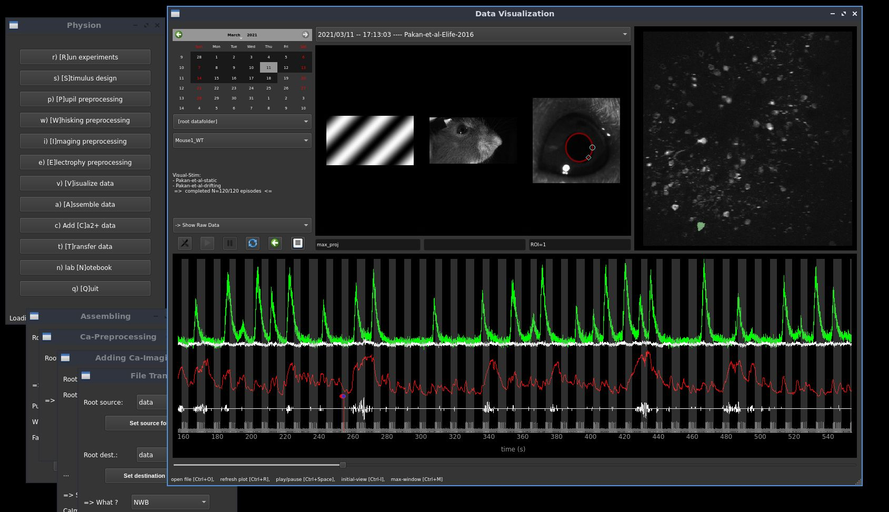

<div></div>

# physion -- Vision Physiology

> *Code for experimental setups and analysis pipelines to study cellular and network physiology in visual cortical circuits*

--------------------

The software is organized into several modules to perform the acquisition, the preprocessing, the visualization and the analysis of multimodal recordings (see [Documentation below](README.md#modules-and-documentation)).

### Software screenshot

<p align="center">
  
</p>

--------------------

## Install

1. Install a python distribution for scientific analysis:

   get the [latest Miniconda distribution](https://docs.conda.io/en/latest/miniconda.html) and install it on your home folder.
   
2. Run the following in the [Anaconda prompt](https://docs.anaconda.com/anaconda/user-guide/getting-started/#write-a-python-program-using-anaconda-prompt-or-terminal):

   clone the repository using git:
   ```
   git clone https://github.com/yzerlaut/physion
   ```
   to create the `physion` environment and perform the installation, run:
   ```
   cd physion
   conda env create -f environment.yml
   ```
   For an installation on an acquisition setup, see the [dedicated instructions](physion/hardware_control/#Installation)

3. *Optional* Install submodule dependencies to benefit from the full analysis and data-visualization features

   ```
   git submodule init
   git submodule update
   pip install physion/dataviz/datavyz/.  # datavyz sub-module, see  
   pip install physion/analysis/analyz/.   # analyz sub-module
   ```

## Getting started

After the installation, the program is the launched from the [Anaconda prompt](https://docs.anaconda.com/anaconda/user-guide/getting-started/#write-a-python-program-using-anaconda-prompt-or-terminal) by typing:
   ```
   conda activate physion	
   python -m physion
   ```

## Modules and documentation

The different modules of the software are documented in the following links:

- [Visual stimulation](physion/visual_stim/README.md) -- relying on [PsychoPy](https://psychopy.org)
- [Performing multimodal recordings](physion/exp/README.md)
- [Intrinsic Imaging](physion/intrinsic/README.md)
- [Electrophysiology](physion/electrophy/README.md)
- [Calcium imaging](physion/Ca_imaging/README.md) -- pipeline based on [Suite2P](https://github.com/MouseLand/suite2p)
- [Pupil tracking](physion/pupil/README.md)
- [Behavioral monitoring](physion/behavioral_monitoring/README.md) 
- [Assembling pipeline](physion/assembling/README.md)
- [Hardware control](physion/hardware_control/README.md)
- [Visualization](physion/dataviz/README.md) -- relying on the excellent [PyQtGraph](http://pyqtgraph.org/)
- [Analysis](physion/analysis/README.md)

## Troubleshooting / Issues

Use the dedicated [Issues](https://github.com/yzerlaut/physion/issues) interface of Github.