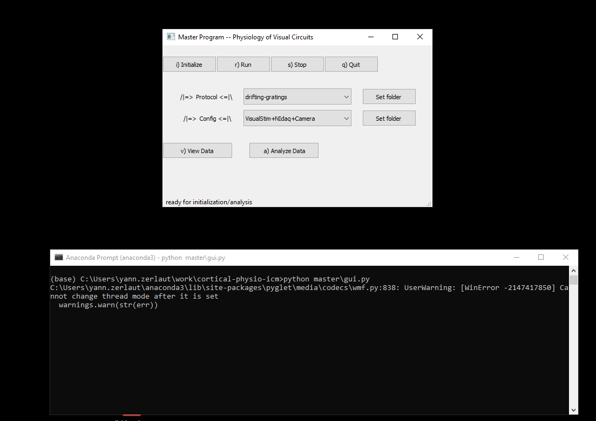

<div></div>

# Vision Physiology

> *Code for experimental setups and analysis pipelines to study cellular and network physiology in visual cortical circuits*

## Modules

- [Multimodal recordings](exp/README.md)
- [Visual stimulation](visual_stim/README.md)
- [Assembling pipeline](assembling/README.md)
- [Electrophysiology](electrophy/README.md)
- [Calcium imaging](Ca_imaging/README.md) -- forked from [Suite2P](https://github.com/MouseLand/suite2p)
- [Pupil tracking](pupil/README.md)
- [Behavioral monitoring](behavioral_monitoring/README.md) -- forked from [FaceMap](https://github.com/MouseLand/facemap)
- [Hardware control](hardware_control/README.md)
- [Visualization](dataviz/README.md)
- [Analysis](analysis/README.md)

## How do I get set up ?

#### 1) Get a scientific python distribution

Install a python distribution for scientific analysis, [get the latest Miniconda distribution](https://docs.conda.io/en/latest/miniconda.html) or [the full Anaconda distribution](https://www.anaconda.com/products/individual)

#### 2) Download this repository

Either:
- For contributors (requires a github account). Fork this repository and clone your own fork.
- For `git` users, clone the repository with `git clone https://github.com/yzerlaut/cortical-physio-icm`
- For others, download the [zip archive](https://github.com/yzerlaut/cortical-physio-icm/archive/master.zip)

#### 3) Install dependencies

Open the Anaconda prompt (or the UNIX shell) and use `pip` to install the dependencies:

```
pip install -r requirements.txt
```

Example of the full process from the Anaconda prompt:

<p align="center">
  
</p>


## Running the program

The master program for experiments is launched from the "Anaconda prompt" by typing:
```
python -m physion
```

<p align="center">
  
</p>


You can now pick the specific module that you want to use.


It loads by default the `protocols` and `configurations` stored in [master/protocols/](master/protocols/) and [master/configs/](master/configs/) respectively. Store your protocols and recordings configurations there and you will be able to pick them from the GUI.

## Preparing protocols and configuring experiments

Go to the individual modules for the details about the settings of protocols:
- [Visual stimulation](visual_stim/README.md)
- [Electrophysiology](electrophy/README.md)
- [Calcium imaging](Ca-imaging/README.md)
- [Behavioral monitoring](behavioral_monitoring/README.md)

## Pre-processing data (alignement, pre-processing, ... )

The master program to pre-process datafiles is launched with:
```
python master\preprocessing.py
```

## Analyzing experiments

The master program to configure experiments is launched with:
```
python master\analysis.py
```

All included analysis should be implemented annd described within the [Analysis module](analysis/README.md)

We also showcase a few analysis as [Jupyter Notebooks](https://jupyter.org/) in the different modules. They can be launched by opening the Anaconda prompt (or the UNIX shell) and by running (taking the example of "Ca-imaging/preprocessing_demo.ipynb"):
```
jupyter notebook Ca-imaging/preprocessing_demo.ipynb
```
You can then run cells and play with the code in your browser.

## Troubleshooting / Issues

Use the dedicated [Issues](https://github.com/yzerlaut/cortical-physio-icm/issues) interface of Github.

