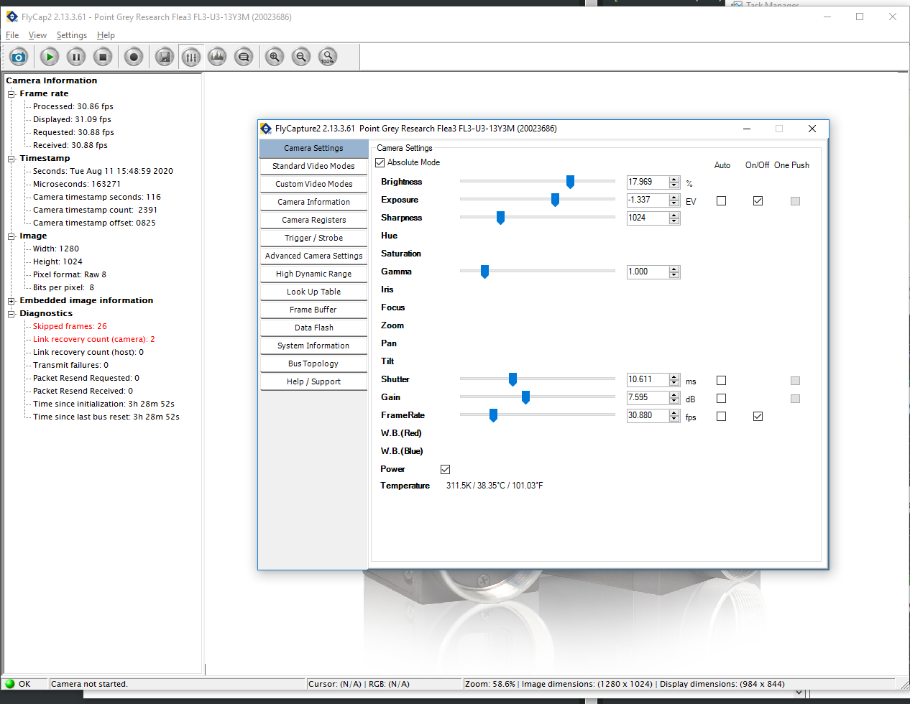

# Behavioral monitoring

## Monitoring of locomotion activity

- Using a rotary encoder 

  

The algorithm to compute the position was base on the case by case transitions depicted in the drawing above (left panel), [./locomotion.py](./locomotion.py)

## Configure cameras

### 1) Face camera

Use the FlyCap software provided by *PT-Grey Camera* to set the acquisition frequency, gain, brightness, etc... that best suits the experiment.

*(current settings below)*

  

### 2) Webcam for the rig view

Use the *Logitech Capture* app.

## Monitoring of running speed

[...]

## Video monitoring of pupil diameter

[...]

## Video monitoring of whisking

[...]
