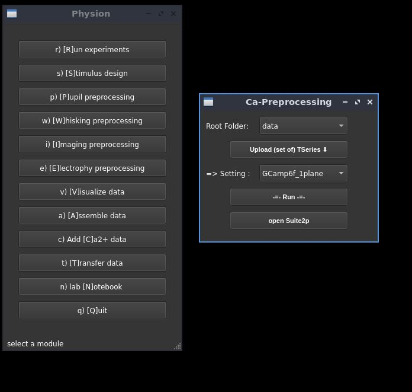

# Calcium imaging

## Experimental procedure

- [imaging window targeting V1](../../doc/drawing-window.png).
- ...

## Raw data transfer and conversion to tiff files

- use `ssh` to transfer the raw data

- use the image block ripping utility from Bruker to convert the raw data to tiff files. Download the program from your Prairie version, see [https://pvupdate.blogspot.com/](https://pvupdate.blogspot.com/) (e.g. Prairie 5.5 at the [following link](https://www.brukersupport.com/File/?id=61188&folderid=44665)).
  
## Registration and Cell detection

The pipeline relies on [Suite2P](https://github.com/MouseLand/suite2p). Read the documentation at [http://mouseland.github.io/suite2p](http://mouseland.github.io/suite2p).

A minimal interface allow to launch the [Suite2P](https://github.com/MouseLand/suite2p) in the background with presets:

<p align="center">
  
</p>

Those settings are set by modifying the default options (see `ops0` in  [process_xml.py file](./process_xml.py)) in the [preprocessing.py file](./preprocessing.py), we modify the keys with a dictionary of the form:

```
PREPROCESSING_SETTINGS = {
    'GCamp6f_1plane':{'cell_diameter':20, # in um
                      'sparse_mode':False,
                      'connected':True,
                      'threshold_scaling':0.8},
    'NDNF+_1plane':{'cell_diameter':20, # in um
                    'sparse_mode':True,
                    'connected':True,
                    'threshold_scaling':0.8},
}
```
Each entry will be a default settings appearing in the GUI.

N.B. we extract the available information form the `xml` Bruker file, see here [an example file](./Bruker_xml/TSeries-190620-250-00-002.xml).

## Preprocessing and analysis
	
The preprocessing step and some analysis are documented in the [demo notebooks](../../notebooks)