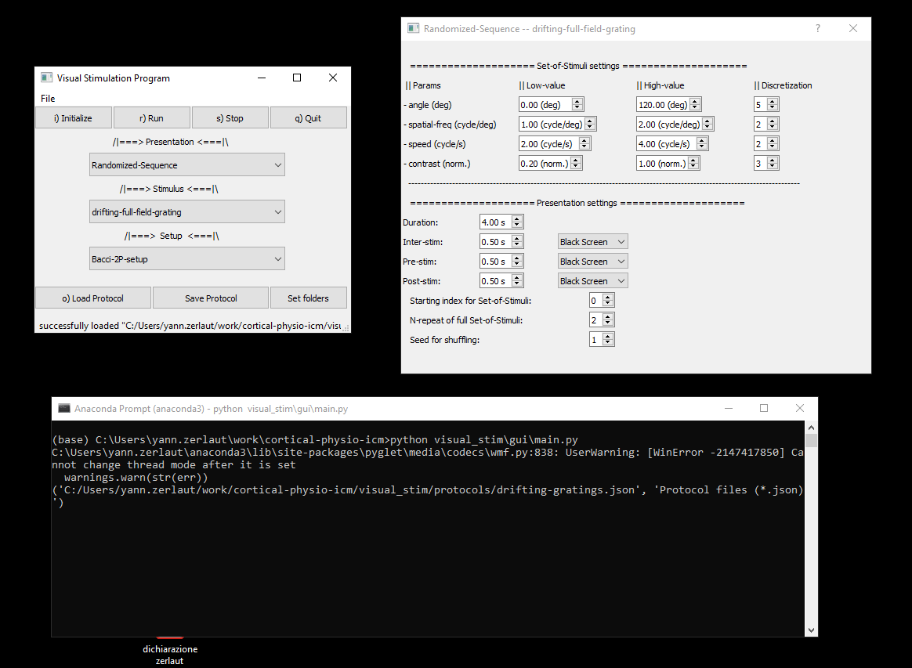
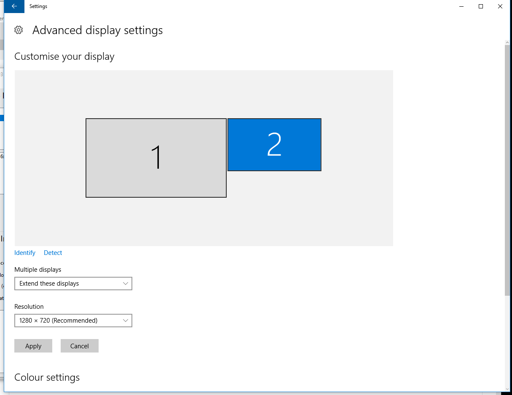
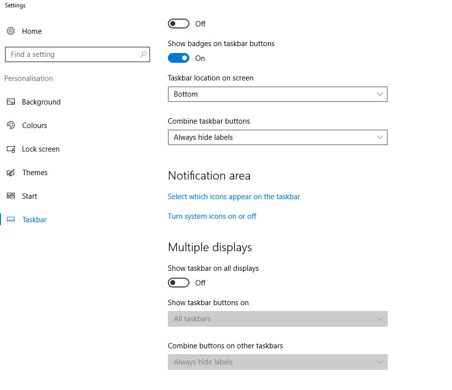
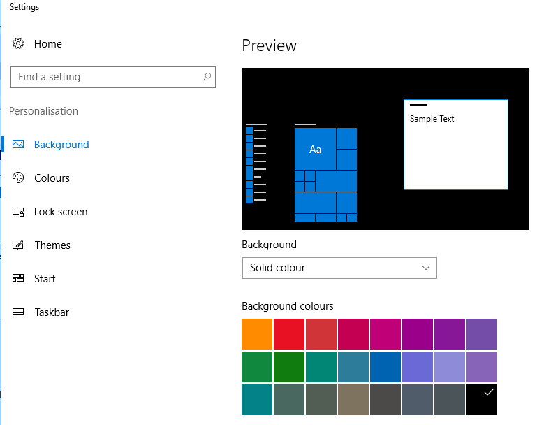
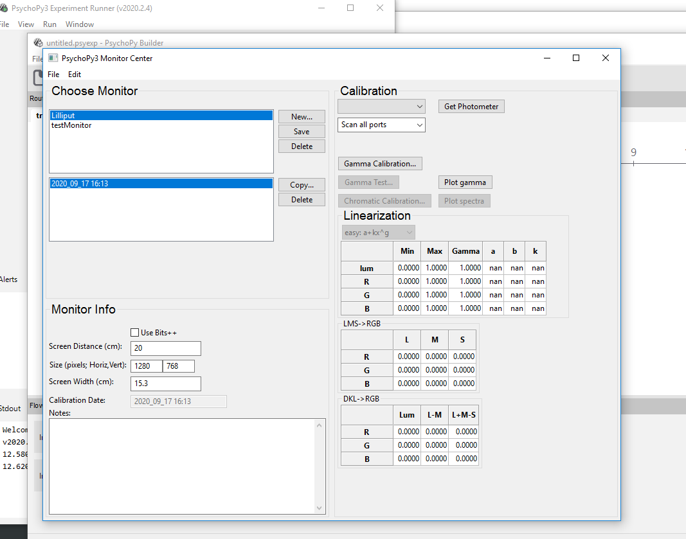
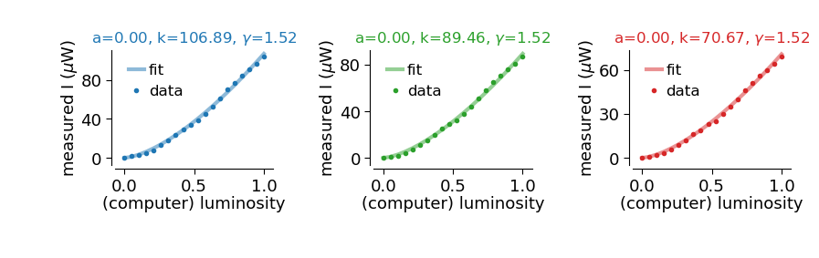

# Visual stimulation

## Configuration/Installation

Go through the steps of the [README](../README.md) of the repository.

First install a python distribution from: https://www.anaconda.com/products/individual

The stimulus presentation relies on the [PsychoPy module](https://www.psychopy.org).  The custom code for the GUI and the set of stimulus lies in the present repository: ["psychopy_code" folder](./psychopy_code/) and ["gui" folder](./gui/).

A few examples, that were used to design and calibrate the stimuli, can be found in the [psychopy_code/demo_stim.py](./psychopy_code/demo_stim.py)

## Running the visual stimulation program

Open the Anaconda prompt and run:

```
python visual_stim\gui\main.py
```

There is a `"demo"` mode to adjust and build the protocols.

<p align="center">
  
</p>


## Screen settings

### Windows level

We need to set the following settings:

#### Display

<p align="center">
  
</p>

#### Behavior of the taskbar

<p align="center">
  
</p>

#### Background

<p align="center">
  
</p>

### Psychopy level

In the "Monitor center", we need to have the following settings:

<p align="center">
  
</p>

N.B. we don't use the gamma correction of psychopy, it doesn't work, we deal with it below.

## Gamma correction

We present a uniform full-screen at different levels of luminance, we use a photometer to measure the true light intensity in the center of the screen.

We fit the formula `f(x) = a + k * x^g ` (constrained minimization, see [gamma-correction.py](./gamma-correction.py) and fits below).
We then insert the `a`, 'k' and 'g' parameters in the "Monitor center" of `psychopy`.

<p align="center">
  
</p>

The measurements and fitting procedure are described in the script: [gamma-correction.py](./gamma-correction.py).

## Set of stimuli

The set of stimuli implemented can be visualized in the GUI (with the parameters of each stimulus type).

They are documented in the [file of default parameter](./default_params.py).

## Realign physiological recordings

see the [Assembling module](../assembling/README.md)

